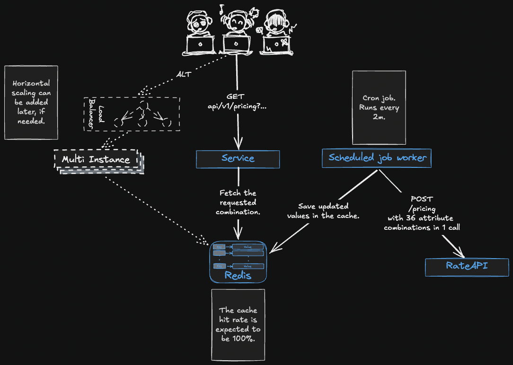

# Assumptions

The solution was designed with these assumptions in mind.

- RateAPI's performance/reliability can't be immediately improved and has to be worked around.
- The service API is called by the gateway/frontend, which will retry in the unlikely scenario that the service returns code 5XX.
- The assumed max response latency tolerance of the service's API end client is 1s.
- The infrastructure (apart from RateAPI) is reliable, with industry-standard uptime of 99.999%.
- The traffic distribution is unknown, meaning we don't know if it's uniform throughout the day vs. single burst vs. spread during waking hours, etc.

# Solution

## TL;DR



This solution takes advantage of three facts: 
- (1) Responses from the RateAPI can be cached for 5 minutes. 
- (2) The number of unique request parameter combinations is tiny: `3x3x4=36`. 
- (3) All 36 combinations can be requested from the RateAPI in a single call, consuming only 1 request out of the daily quota of 1000 requests.

The background worker (Sidekiq cron job) will be started in a container adjacent to the main app container. 
It will immediately warm the cache on its startup. Subsequent cache refreshes will happen every 2 minutes, managed by the same worker process.
The cache refresh job is robust and will exponentially retry on transient errors within the current 2-minute wall-clock slot, stopping with a 1-second safety margin before the next slot. 
Each slot is atomically claimed in Redis, so duplicate, delayed, or concurrently started jobs for the same slot exit without calling RateAPI. 
Claims are not released; the next refresh uses a different time slot key. In the unlikely scenario where a refresh is unsuccessful, the following slot gets an independent opportunity before the 5-minute cache TTL expires. 
With a 22.6% independent fault rate, the expected number of RateAPI calls per day is approximately `720 / (1 - 0.226) = 930`, including retries, which is below the RateAPI limit of 1000 requests/day.

The requests coming to the service at `api/v1/pricing` will never hit the RateAPI directly, instead fetching the cached values from Redis,completely bypassing the RateAPI daily limits and satisfying the constraint of the API being able to serve 10000 req/day. 
Moreover, fetching the cached values is extremely fast, so even a single service instance with the default concurrency settings (`RAILS_MAX_THREADS=5`; `WEB_CONCURRENCY=1`) will be able to handle pretty good concurrent RPS (see the Load Test section below for results). 
If the service ever needs to handle more extreme load, the solution can be trivially horizontally scaled  by adding more instances.

The service will be made observable through data-rich, structured logging. For a service with only one handler and use case, adding metrics or tracing would be overkill, in my opinion.

## Error handling and probabilities of failure

The RateAPI is unreliable (it hangs; 5XX; returns 2XX when it errors). As such, our service will retry the request to it in the following cases: (1) on any code other than 2XX (because it doesn't correctly map the codes); (2) timeout (>50 ms, set empirically; 5x the P99 latency when it doesn't hang); (3) when it returns code 2XX, but the payload is invalid (JSON parsing failed, unexpected shape, missing keys, wrong key types, missing requested combinations); (4) all other exceptions (connection errors, network errors, I/O errors, etc.).

With the tests concerning Redis in place and the infrastructure uptime assumed to be 99.999% (expected to be down <0.86 sec/day), any Redis error
will be considered transient and will be retried.

The background refresh job will retry in both cases mentioned above, using exponential backoff starting at 5 ms and continuing until it either
succeeds or reaches the end of its current 2-minute wall-clock slot, minus a 1-second safety margin. Time spent claiming the slot is part of this
same deadline, and the job checks the deadline again before writing rates. A job starting exactly at a slot boundary can make at most 15 attempts
within that window. Assuming independent failures, the chance that two full-slot refreshes both fail is
`(0.226¹⁵)² × 100%`, which is extremely small.


Considering all of the above, it's extremely unlikely that Redis will be down or a cache search will result in a miss when the service returns
cached data to callers. But since we need to define how the service will behave if that happens, it will return 503 (Unavailable), expecting the
gateway/frontend that is sending the request to retry after a while. Implementing an internal retry in this case is pointless because the assumed
client tolerance is just 1 second. Forwarding requests directly to RateAPI won't be of any benefit because the estimated unused daily capacity of ~70 req will not be enough to satisfy the 10000 req/day constraint.

# Load test

I decided to do load testing of the final solution to see how much traffic a single instance of the service can handle doing nothing else besides
reading from the cache.

The load testing strategy was to spawn N green threads, where `N=RPS`, and have them concurrently send a request to `api/v1/pricing` with one of the
36 possible combinations. Here are the results.

## 100 RPS

A single deploy was able to handle 100 RPS without an issue.

```
Final results
-------------
Run time:                    1m39.995s
Total requests:              10000
Failed/aborted:              0.00%
Succeeded on first try:      100.00%
Succeeded after retry:       0.00%
Response time min:           3.16 ms
Response time median:        4.59 ms
Response time max:           149.62 ms
```

## 1000 RPS

At 1000 RPS, a single instance of the service starts choking. If we expect the traffic to be this concentrated, scaling vertically or horizontally
would be required.

```
Final results
-------------
Run time:                    3m7.224s
Total requests:              10000
Failed/aborted:              0.00%
Succeeded on first try:      2.89%
Succeeded after retry:       97.11%
Response time min:           35.51 ms
Response time median:        12846.82 ms
Response time max:           149699.88 ms
```

# RateAPI Behavior

THE GOOD. Can return all 36 possible combinations in one call. The daily budget can be used in a single minute/second, not forcing the spread
throughout the day.

THE BAD. Extremely unreliable. Returns 5XX, hangs, returns 2XX with a payload that is not the rates. Consumes the daily budget even when it errors
out. The combined rate of requests that do not result in a response we need is 22.6%.

```
Results
-------
Batch size (items):   36
Attempts:             1000
Successful (valid 200):  774
Errors (non-200):        76
HTTP 200 error payloads:  72
Incomplete batch results:  0
Invalid HTTP 200 payloads: 0
Client timeouts:          78
Error rate:              7.60% (76/1000)
HTTP 200 error rate:     7.20% (72/1000)
Incomplete batch rate:   0.00% (0/1000)
Invalid HTTP 200 rate:   0.00% (0/1000)
Combined fault rate:     14.80% (148/1000)
Timeout rate:            7.80% (78/1000)

Latency of successful batch responses
-------------------------------------
Samples:              774
Average total time:   3.19 ms
Minimum total time:   1.44 ms
p50 total time:       3.14 ms
p95 total time:       4.20 ms
p99 total time:       4.86 ms
Maximum total time:   11.02 ms
```

# Example of the service's logs:

The sidekiq boots and immediately warms the cache. Then the main service starts.

```
sidekiq-1   | INFO  2026-07-20T08:49:21.734Z pid=1 tid=7ch jid=e09c0466ea896e69aef88bfe class=RateRefreshJob: {:event=>"rate_refresh_succeeded", :slot_key=>"rate_refresh:v1:slot:14871144", :attempts=>2, :keys_written=>36, :duration_ms=>12}
sidekiq-1   | INFO  2026-07-20T08:49:21.735Z pid=1 tid=7ch jid=e09c0466ea896e69aef88bfe class=RateRefreshJob elapsed=0.135: done
interview-dev-1  | => Booting Puma
```

Scheduled cache refresh 2m after the initial boot.

```
sidekiq-1        | INFO  2026-07-20T08:50:33.604Z pid=1 tid=7dl jid=5362623778c1e4cbef19ab5f class=RateRefreshJob: {:event=>"rate_refresh_succeeded", :slot_key=>"rate_refresh:v1:slot:14871145", :attempts=>4, :keys_written=>36, :duration_ms=>50}
sidekiq-1        | INFO  2026-07-20T08:50:33.605Z pid=1 tid=7dl jid=5362623778c1e4cbef19ab5f class=RateRefreshJob elapsed=0.059: done
```

The server processes the request from the client.

```
interview-dev-1  | Started GET "/api/v1/pricing?period=Summer&hotel=FloatingPointResort&room=SingletonRoom" for 192.168.65.1 at 2026-07-20 08:49:58 +0000
interview-dev-1  |   ActiveRecord::SchemaMigration Load (0.1ms)  SELECT "schema_migrations"."version" FROM "schema_migrations" ORDER BY "schema_migrations"."version" ASC
interview-dev-1  | Processing by Api::V1::PricingController#index as */*
interview-dev-1  |   Parameters: {"period"=>"Summer", "hotel"=>"FloatingPointResort", "room"=>"SingletonRoom"}
interview-dev-1  | {:event=>"pricing_request", :request_id=>"37f3f809-17ec-414e-8eb0-abe2ae5773c9", :period=>"Summer", :hotel=>"FloatingPointResort", :room=>"SingletonRoom", :outcome=>"success", :cache=>"hit", :status=>200}
interview-dev-1  | Completed 200 OK in 6ms (Views: 0.1ms | ActiveRecord: 0.0ms | Allocations: 3141)
```

Invalid request by the client.

```
interview-dev-1  | Started GET "/api/v1/pricing?period=Summer&hotel=FloatingPointResort&room=SingletonRoo" for 192.168.65.1 at 2026-07-20 08:50:26 +0000
interview-dev-1  | Processing by Api::V1::PricingController#index as */*
interview-dev-1  |   Parameters: {"period"=>"Summer", "hotel"=>"FloatingPointResort", "room"=>"SingletonRoo"}
interview-dev-1  | Filter chain halted as :validate_params rendered or redirected
interview-dev-1  | Completed 400 Bad Request in 1ms (Views: 0.2ms | ActiveRecord: 0.0ms | Allocations: 110)
```

# Local setup

Create .env:

```dotenv
RATE_API_TOKEN=replace-with-your-token
RATE_API_TIMEOUT_MS=50
RATE_CACHE_TTL_SECONDS=300
```

RATE_API_TOKEN is required. RATE_API_TIMEOUT_MS and RATE_CACHE_TTL_SECONDS are optional and default to 50 and 300. RATE_API_URL and REDIS_URL are set by Docker Compose.

Here is a list of common commands for building, running, and interacting with the Dockerized environment.

```bash
# --- 1. Build & Run The Main Application ---
# Build and run the Docker compose
docker compose up -d --build

# --- 2. Test The Endpoint ---
# Send a sample request to your running service
curl 'http://localhost:3000/api/v1/pricing?period=Summer&hotel=FloatingPointResort&room=SingletonRoom'

# --- 3. Run Tests ---
# Run the full test suite
docker compose exec interview-dev ./bin/rails test

# Run a specific test file
docker compose exec interview-dev ./bin/rails test test/controllers/pricing_controller_test.rb

# Run a specific test by name
docker compose exec interview-dev ./bin/rails test test/controllers/pricing_controller_test.rb -n test_returns_the_cached_rate_on_a_cache_hit
```


# Did I use AI?

I use AI in my day-to-day work, so I will utilize it here as well. I have the following philosophy toward AI: "You can outsource a lot of things, but not your understanding." As such, here's how I used it.

What is done by me:

- Understanding of the task at hand, constraints, and limitations.
- Planning and formulation of the solution.
- Splitting the solution into bite-sized chunks to be implemented.
- Testing plan and test cases.
- Review of the written code; stylistic improvements and simplification recommendations.

What I will leave to the AI/consult the AI on:

- Enumeration of the existing directory structure.
- Ruby/Rails conventions, syntax, and library recommendations.
- Writing of the Ruby code.
- Additional adversarial code review by a different model to catch things my Ruby-untrained eye can't yet.
